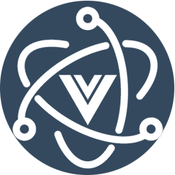

# vue-electron-cli

基于Vue CLI搭建的Electron脚手架, 封装了最佳实践的多窗口处理以及主进程和渲染进程之间通信等 ui库使用 element-plus(已配置按需导入), css 框架使用 tailwindcss(下一代css框架)

<!-- PROJECT SHIELDS -->

[![Contributors][contributors-shield]][contributors-url]
[![Forks][forks-shield]][forks-url]
[![Stargazers][stars-shield]][stars-url]
[![Issues][issues-shield]][issues-url]
[![MIT License][license-shield]][license-url]
<!-- [![LinkedIn][linkedin-shield]][linkedin-url] -->

<!-- PROJECT LOGO -->
<br />

<p align="center">
  <a href="https://github.com/viarotel/vue-electron-cli" target="_blank">
    
  </a>
  <h3 align="center">vue-electron-cli</h3>
  <p align="center">
    基于Vue CLI搭建的Electron脚手架
    <br />
    <a href="https://github.com/viarotel/vue-electron-cli" target="_blank"><strong>探索本项目的文档 »</strong></a>
    <br />
    <br />
    <a href="https://vue-electron-cli.vercel.app/" target="_blank">查看Demo</a>
    ·
    <a href="https://github.com/viarotel/vue-electron-cli/issues" target="_blank">报告Bug</a>
    ·
    <a href="https://github.com/viarotel/vue-electron-cli/issues" target="_blank">提出新特性</a>
  </p>


## 目录

- [上手指南](#上手指南)
  - [获取本项目](#获取本项目)
  - [运行本项目](#运行本项目)
  - [打包构建](#打包构建)
- [文件目录说明](#文件目录说明)
- [使用到的框架](#使用到的框架)
- [版本控制](#版本控制)
- [作者](#作者)
- [鸣谢](#鸣谢)

### 上手指南

###### **获取本项目**

1. clone 本项目 或 直接下载main包

```sh
git clone https://github.com/viarotel/vue-electron-cli.git
```

###### 运行本项目

1. 安装依赖
2. 运行项目

```sh
npm install //or yarn
npm run electron:serve //or yarn serve
```

###### 打包构建

1. 使用命令打包项目

```sh
npm electron:build //or yarn electron:serve
```

### 文件目录说明

```
filetree
├── /dist //打包生成的浏览器端静态资源文件，用于生产部署。
├── /dist_electron //打包生成的桌面端静态资源文件，用于生产部署。
├── /node_modules //存放npm命令下载的开发环境和生产环境的依赖包。
├── /public/ //存放在该文件夹的东西不会被打包影响，而是会原封不动的输出到dist文件夹中
│  ├── /logos //浏览器端，桌面端中显示的图标
│  ├── /index.html // 入口模板文件
├── /src/
│  ├── /background/ //electron主进程问题目录
│  ├── /assets/ //存放项目中需要用到的资源文件，css、js、images等。
│  ├── /components/ //存放vue开发中一些公共组件
│  ├── /config/ //全局配置文件
│  ├── /directive/ //公共vue指令
│  ├── /icons/ //存放svg图标
│  ├── /mixins/ //公共vue混入
│  ├── /plugins/ //项目用到的插件集合
│  ├── /request/ //接口配置
│  ├── /router/ //路由表
│  ├── /store/ //vuex状态管理
│  ├── /styles/ //公共样式文件
│  ├── /utils/ //存放开发过程中一些公共的js方法。
│  ├── /store/ //vuex状态管理
│  ├── /windows/ //多窗口目录
│  ├── /views/ //vue路由组件页面目录
│  ├── /App.vue //vue组件入口文件
│  ├── /main.js //渲染进程入口文件
├── .gitignore //git忽略文件配置
├── babel.config.js //对js文件进行编译转换增强的配置文件
├── jsconfig.json /JavaScript语言服务的配置文件 代码提示 文件索引提示等
├── LICENSE //开源许可说明
├── package.json  //包管理配置文件
├── postcss.config.js //对css文件进行编译转换增强的配置文件
├── README.md
├── tailwind.config.js //tailwindcss的配置文件
├── vue.config.js //vuecli配置文件
└── yarn.lock //yarn锁定依赖版本 防止环境不一致导致项目无法运行的问题
```

### 使用到的框架

- [electron](https://www.electronjs.org/)
- [Vue-CLI](https://cli.vuejs.org)
- [element-plus](https://element-plus.org/)
- [tailwindcss](https://www.tailwindcss.cn/)
- [axios](http://www.axios-js.com/)

### 关键字

- electron
- vue3.x
- element-plus
- tailwindcss
- axios

### 版本控制

该项目使用Git进行版本管理。

### 作者

viarotel@qq.com

qq:523469508 wx: luyao-ing

 *您也可以在贡献者名单中参看所有参与该项目的开发者。*

### 版权说明

该项目签署了MIT 授权许可，详情请参阅 [LICENSE](LICENSE)

### 鸣谢


- 感谢**[vue-cli-plugin-electron-builder](https://github.com/nklayman/vue-cli-plugin-electron-builder)**提供的插件
- 感谢**[vue-cli-electron-template](https://github.com/Pure-Peace/vue-cli-electron-template)**带给我灵感

<!-- links -->

[your-project-path]:viarotel/vue-electron-cli
[contributors-shield]: https://img.shields.io/github/contributors/viarotel/vue-electron-cli.svg?style=flat-square
[contributors-url]: https://github.com/viarotel/vue-electron-cli/graphs/contributors
[forks-shield]: https://img.shields.io/github/forks/viarotel/vue-electron-cli.svg?style=flat-square
[forks-url]: https://github.com/viarotel/vue-electron-cli/network/members
[stars-shield]: https://img.shields.io/github/stars/viarotel/vue-electron-cli.svg?style=flat-square
[stars-url]: https://github.com/viarotel/vue-electron-cli/stargazers
[issues-shield]: https://img.shields.io/github/issues/viarotel/vue-electron-cli.svg?style=flat-square
[issues-url]: https://img.shields.io/github/issues/viarotel/vue-electron-cli.svg
[license-shield]: https://img.shields.io/github/license/viarotel/vue-electron-cli.svg?style=flat-square
[license-url]: https://github.com/viarotel/vue-electron-cli/blob/master/LICENSE
[linkedin-shield]: https://img.shields.io/badge/-LinkedIn-black.svg?style=flat-square&logo=linkedin&colorB=555
[linkedin-url]: https://linkedin.com/in/viarotel